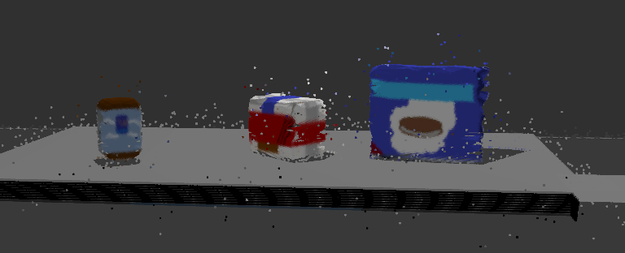
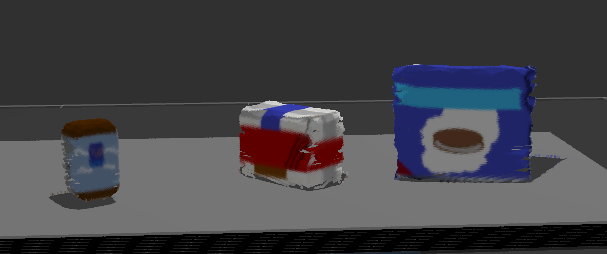
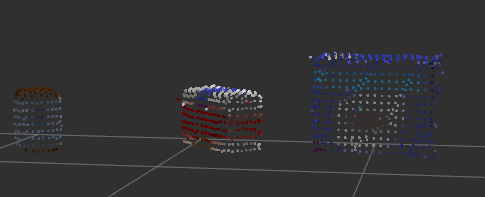
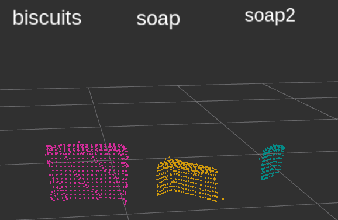
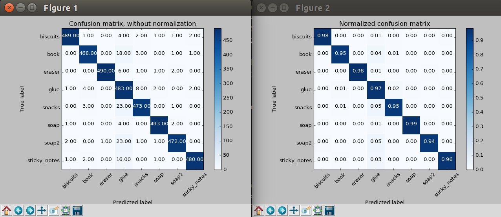
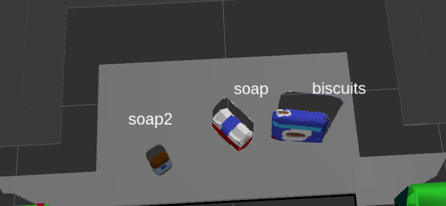
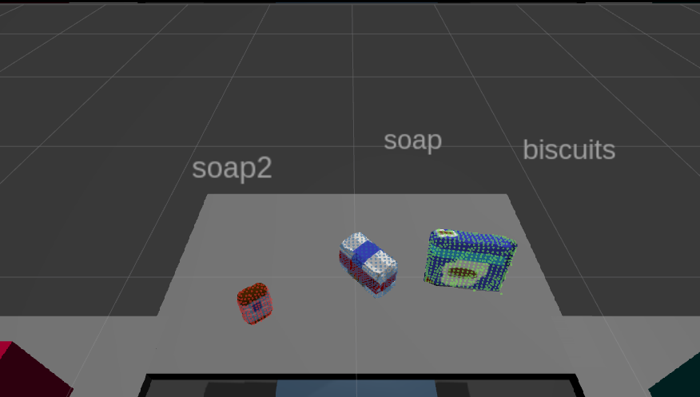
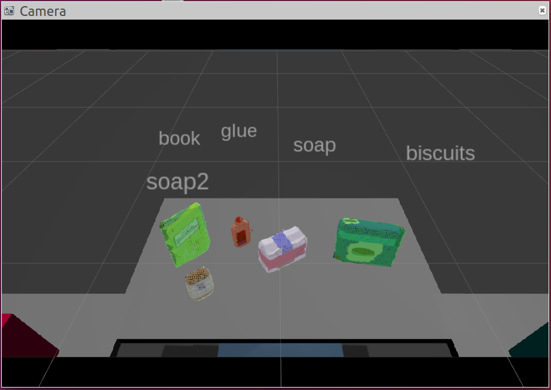
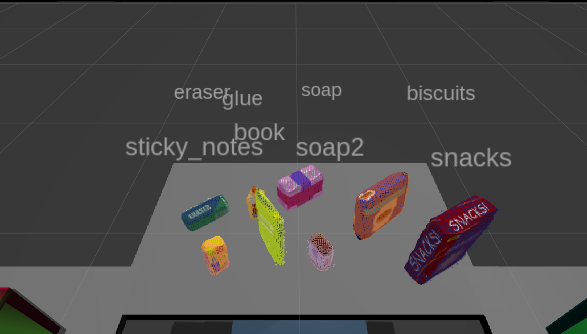

# Project: RoboND Perception Project

## 1. Introduction 

The assignment for this project was to solve the perception part of Amazon's pick and place challenge. The problem has been solved in for today's standards old fashioned way by using SVM classifier for object recognition. Training samples were collected from RGBD camera simulated in Gazebo simulator. In a same way the object detection problem has been done as well.

## 2. Exercise 1 steps. Pipeline for filtering and RANSAC plane fitting implemented.

First I have removed statistical outliers from the camera capture to address for the random distortions. I have done that by using K nearest neighbour algorithm as it can be seen in lines 59-67 of the perception.py file.

Distorted image:

Image after outlier removal:

Then I have down-sampled input cloud by using Voxel Grid Downsampling to remove unnecessary information and speed up the computation (perception.py, lines 69-78). This step required some experimentation to reach the sweet spot between number of points and information preserved.

To remove all the unnecessary information like bottom of the table and bins that will contain objects after objects will be collected, I have filtered input cloud with pass trough filter based on **z** and **x** axes(perception.py, lines 80-102).

The last step of the Exercise 1 was to separate objects from the tabletop area. I have done that with help of RANSAC filtering (perception.py, lines 104-124). The result were 2 point clouds, one representing objects (extracted_outliers) and the other representing tabletop (extracted_inliers).

Point cloud with extracted objects:

## 3. Exercise 2 steps: Pipeline including clustering for segmentation implemented.  

As the next step I have extracted individual objects from the objects point cloud. I have done that with help of Euclidean Clustering (perception.py, lines 126-139). First I have extracted only position related data from the objects point cloud by ignoring RGB colour information with the help of XYZRGB_to_XYZ function(). Then I have applied k-d three method to find clusters of point clouds to extract individual objects. 

Individual object point clouds coloured with different colours:

## 4. Exercise 3 Steps: Features extracted and SVM trained.  Object recognition implemented.
After the individual objects have been extracted from the point cloud I have looped through point clouds of individual objects and performed object detection with the help of previously trained SVM classifier (perception.py, lines 148-176). SVM classifier has been trained based on shape and colour histograms with help of compute_normal_histograms() and compute_color_histograms() functions defined in features.py.

Confusion matrices:

Detected objects:

 

## 5. Pick and Place Setup: For all three tabletop setups (`test*.world`), perform object recognition, then read in respective pick list (`pick_list_*.yaml`). Next construct the messages that would comprise a valid `PickPlace` request output them to `.yaml` format.

As the last step I have passed point clouds of individually detected objects to pr2_mover() function. There I have looped through the list of objects to be collected (pick_list_*.yaml). In case that match has been found while comparing with detected objects I have saved detected object's label and centroid to the yaml dictionary with the help of make_yaml_dict() function (perception.py, lines 200 - 256). Object's centroid has been calculated as an average of x, y and z coordinates of an object's point cloud.

At the end I have saved the list with label names and centroids to yaml file with the help of send_to_yaml() function.

World 1 RViz camera screenshot:

 

World 2 RViz camera screenshot:

 

World 3 RViz camera screenshot:

 

## 6. Conclusion

SVM implementation hasn't proved especially robust for the task of object recognition. When objects are hidden behind other objects there are usually problems with their recognition. In real world scenario I would definitely approach given object recognition problem with help of convolutional neural networks. Nevertheless I found the project very interesting and useful as I have been introduced with RGBD camera and convinced myself how easy it is to work with point cloud information. It was also nice to see how object recognition can be prepared in the Gazebo simulator and enable initial test scenario for working with real world data.